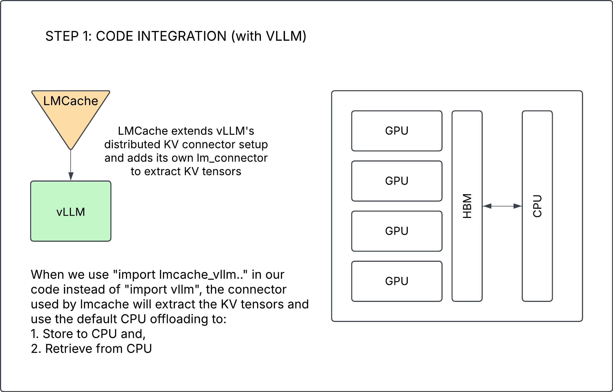
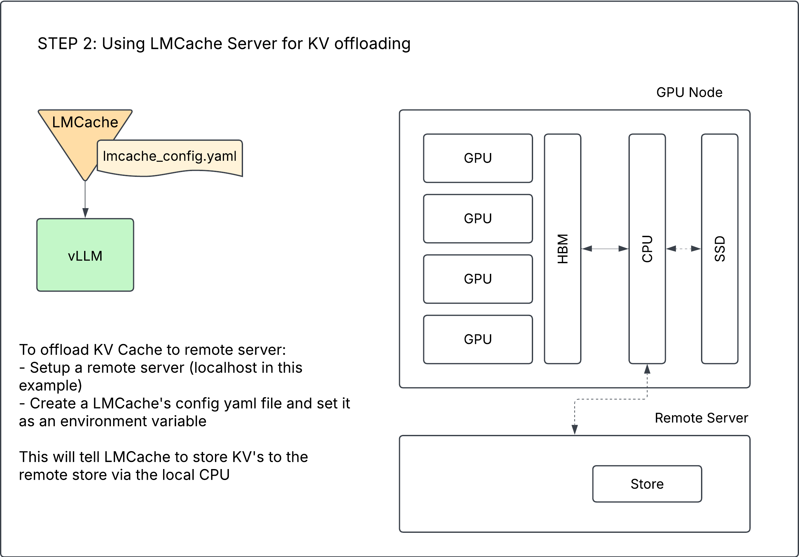

# Sample Integration for your prod environment

This example will use async serving chat (vLLM's OpenAIServingChat to instantiate a model and run sample commands with LMCache) to store KV Cache in CPU memory and host SSD.

## Pre-requisites
vllm version 0.6.2
Your server should have at least 1 free GPU

The example here will use port 8000 (for vLLM) and port 65432 (for LMCache)

## Samples:

### 1: Simple Integration with Default CPU offloading
For this, the only change required is to replace code imports of `vllm` with `lmcache_vllm`. 
The default setting with LMCache is to offload to CPU.
```
LMCACHE_CONFIG_FILE=example_default.yaml CUDA_VISIBLE_DEVICES=0 python3 sample_integration.py
```


### 2: Simple Integration with Remote Server
In one terminal, Run LMCache server. This will be equivalent to your remote server which stores KVs.
Note: the LMCache server can run on any machine (it doesn't require a GPU)
```
lmcache_server localhost 65432
```
In another terminal, run the integration script using example_remote.yaml configuration:
```
LMCACHE_CONFIG_FILE=example_remote.yaml CUDA_VISIBLE_DEVICES=0 python3 sample_integration.py
```
